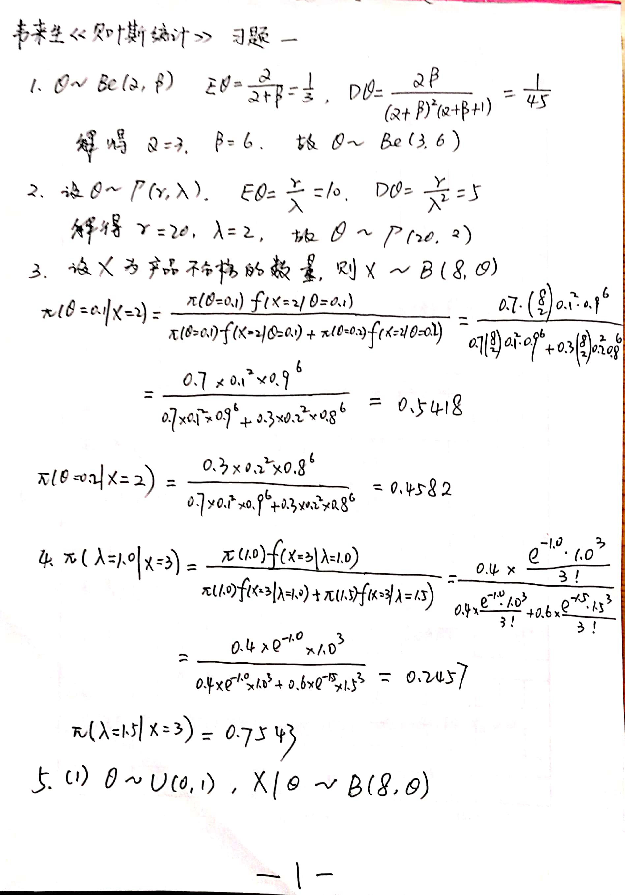
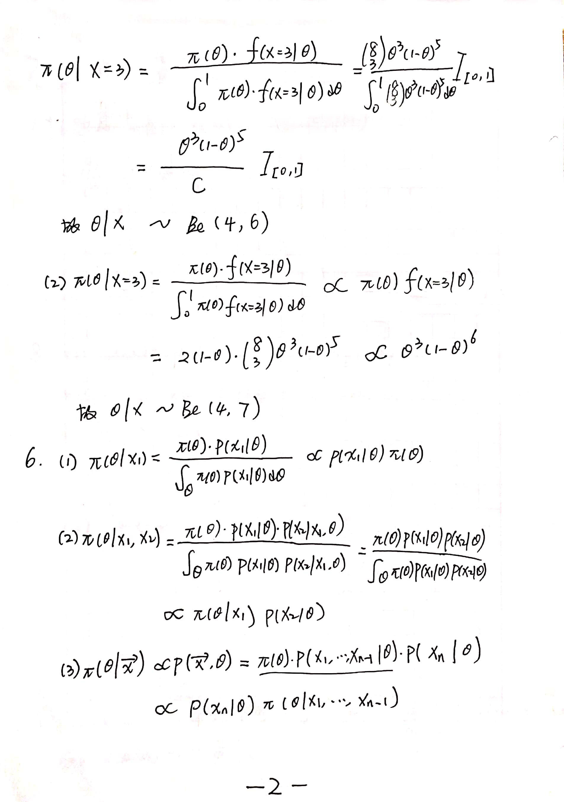
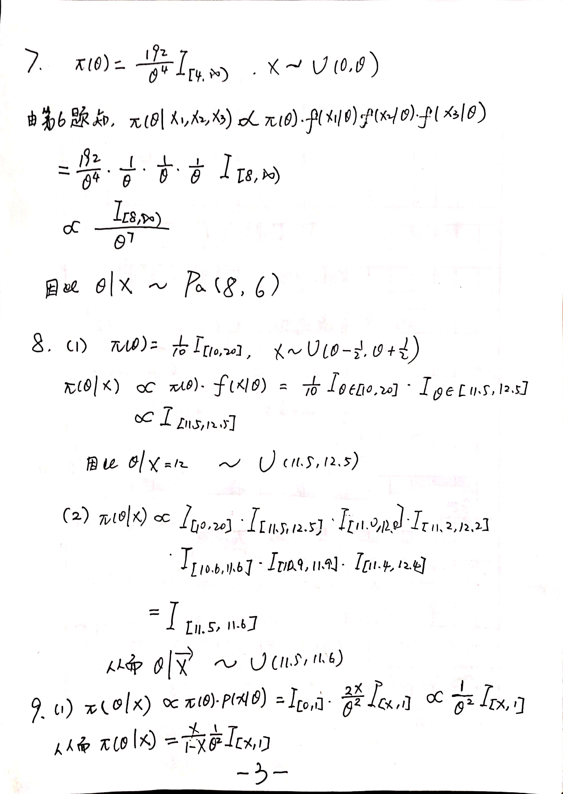
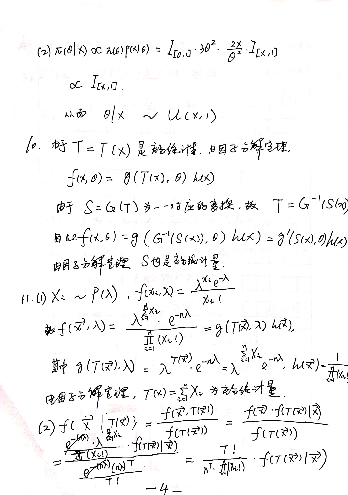
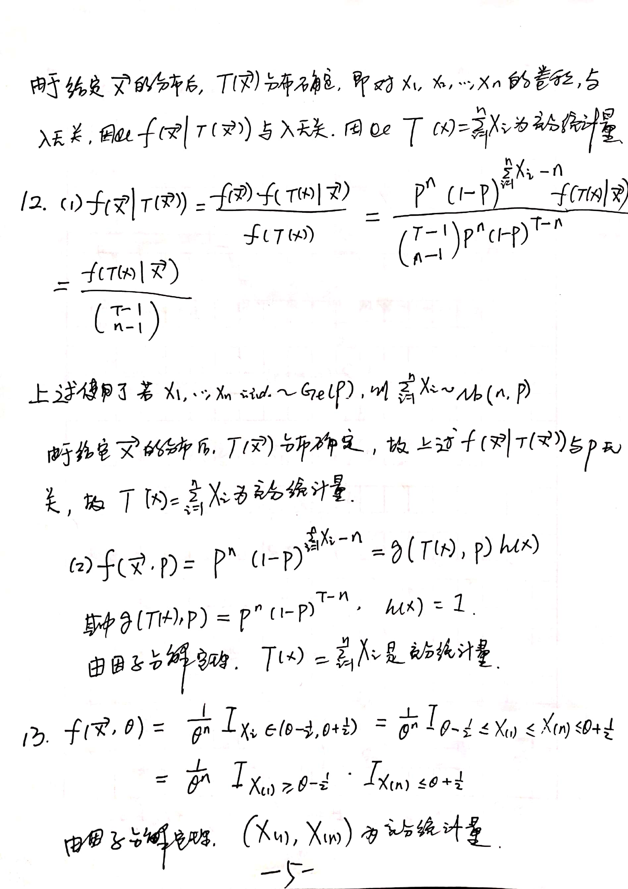
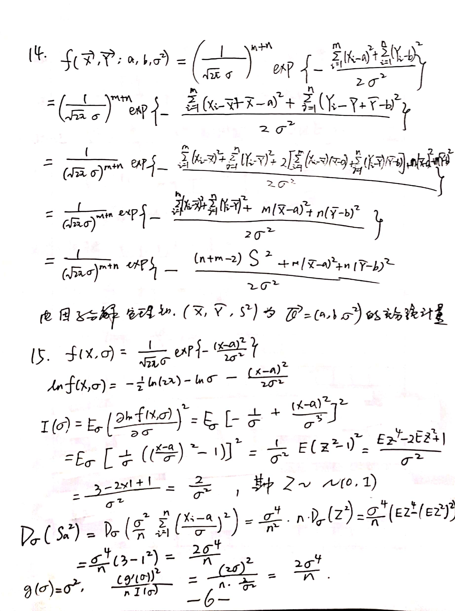
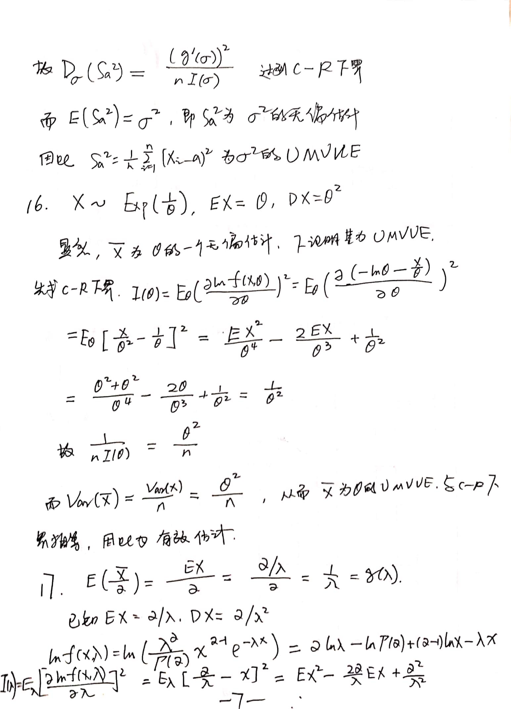
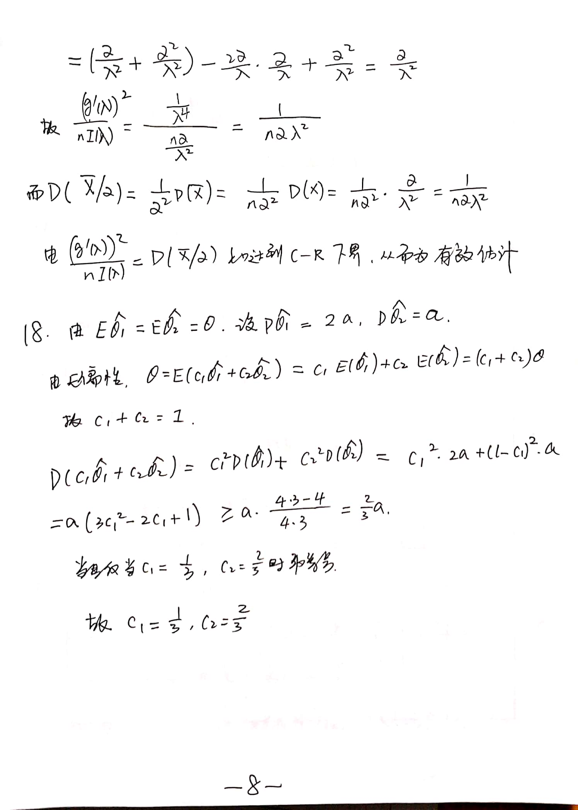
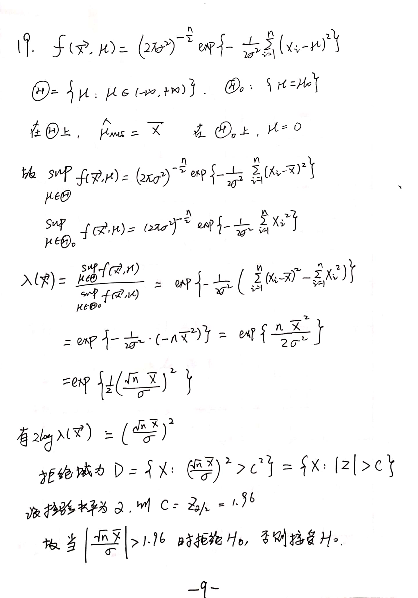
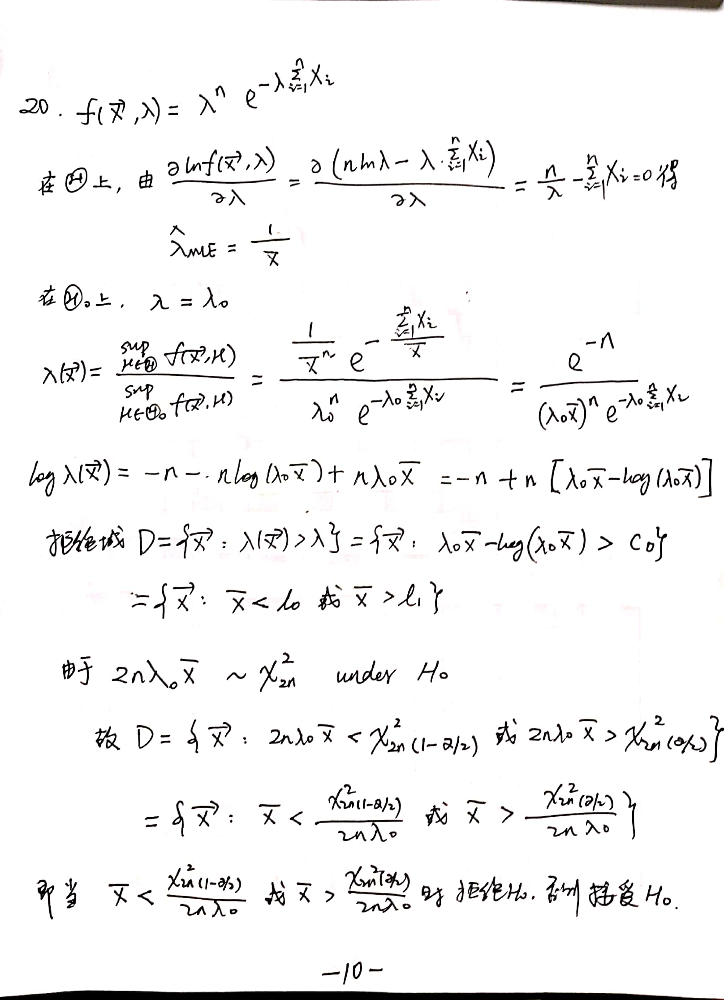

## Some Instructions

The new things we have learned in this chapter are prior distributions(prior dist.) and posterior distributions(post dist.). Also
we should recall the knowledge of statistical inference. Generally speaking, it's not too hard. However it's necessary for us to 
do some exercises as well as recall some old knowledge. 

Written by Jelly Lee, Feb 27th, 2020.

## 一些说明

这一节的新东西主要是先验分布和后验分布，然后就是回顾统计推断的知识。整体来说难度不大，但是回顾一些知识，动动手，还是很有必要的。

Jelly Lee, 2020年2月27日

# Click [Here](https://github.com/liziyue17/Bayesian-Statistics-by-Laisheng-Wei/raw/master/Exercise1/Bayesian%20exercise%201.pdf) To Get Solutions 点击[这里](https://github.com/liziyue17/Bayesian-Statistics-by-Laisheng-Wei/raw/master/Exercise1/Bayesian%20exercise%201.pdf)获取答案

