## Some Instructions

We have just learnt how to calculate prior dist. In my view, doing these exercises is of vital importance! 

Written by Jelly Lee, Feb 29th, 2020.

## 一些说明

我们学习了怎样计算先验分布。在我看来，做这些练习题是非常有必要的！

Jelly Lee, 2020年2月29日

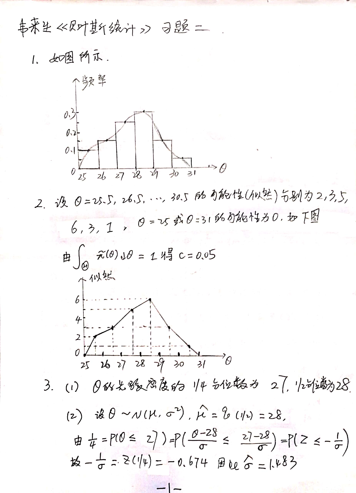

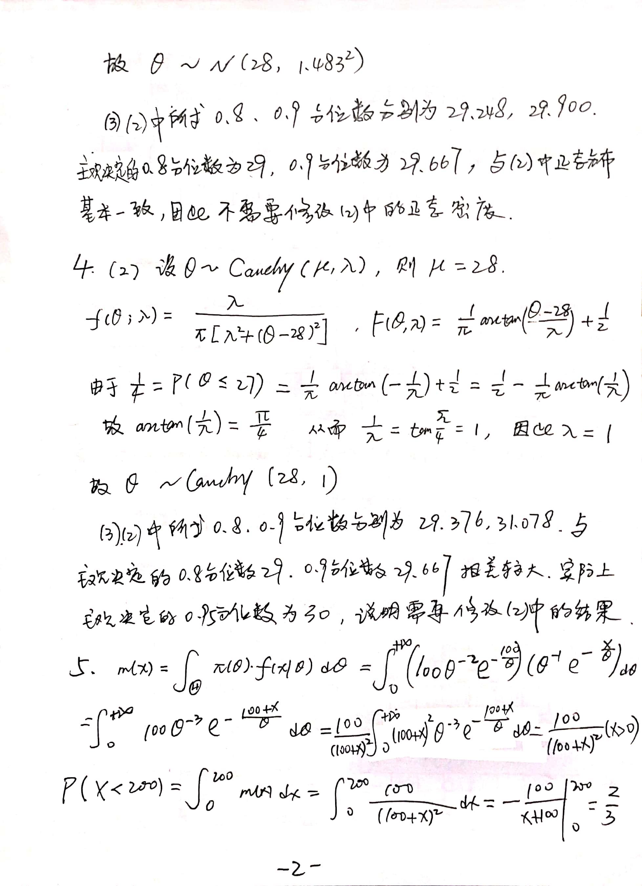

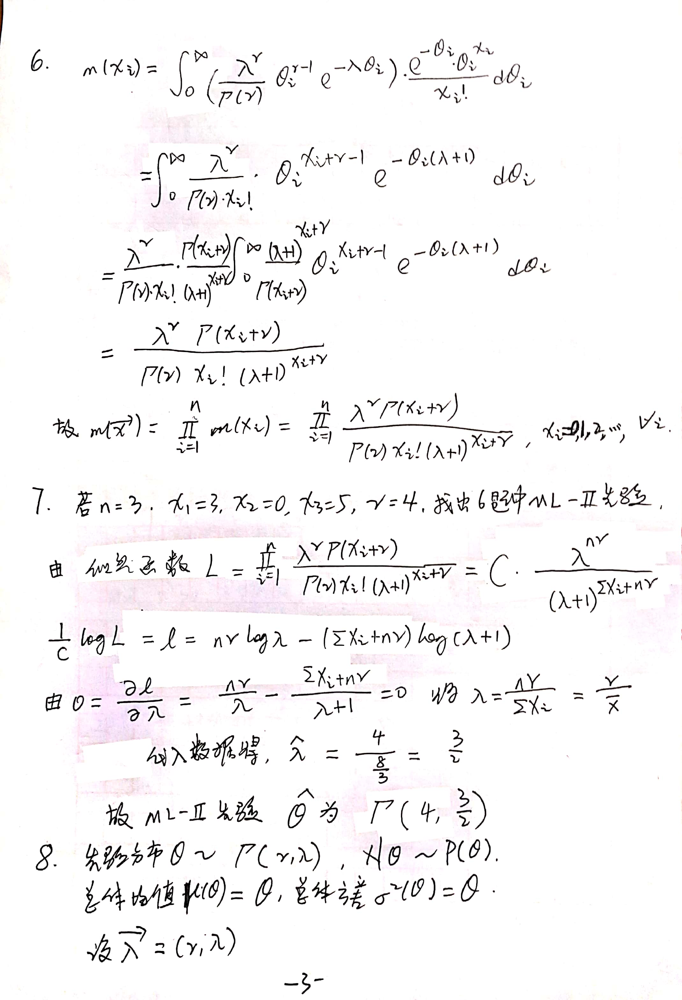

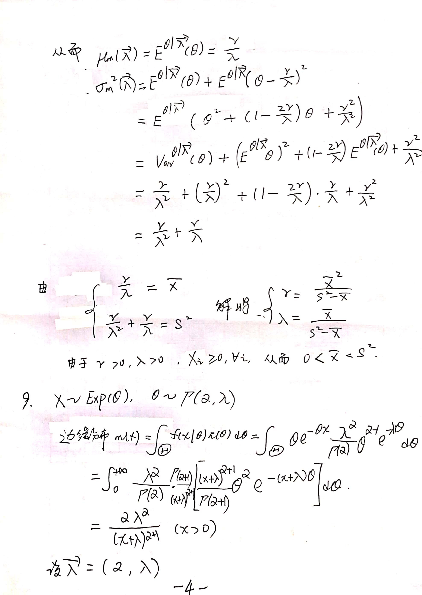

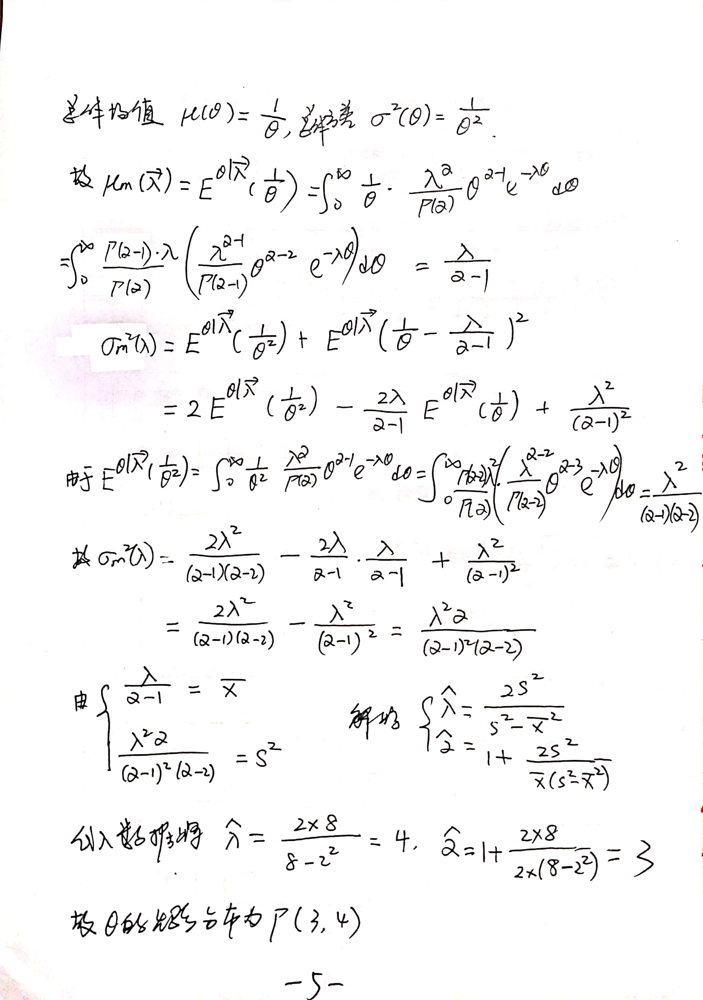

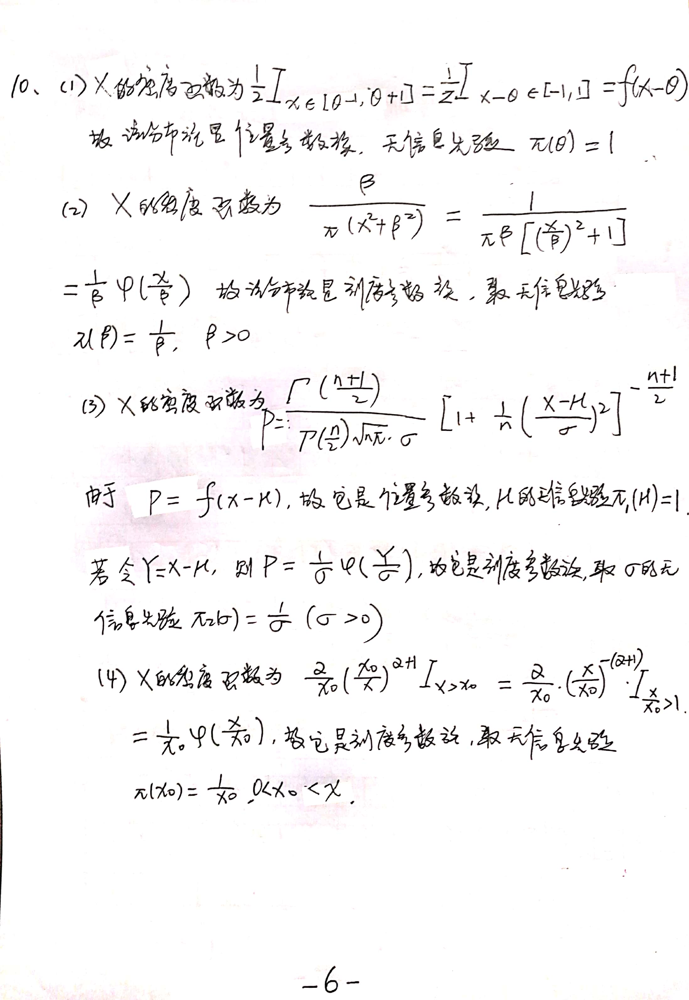

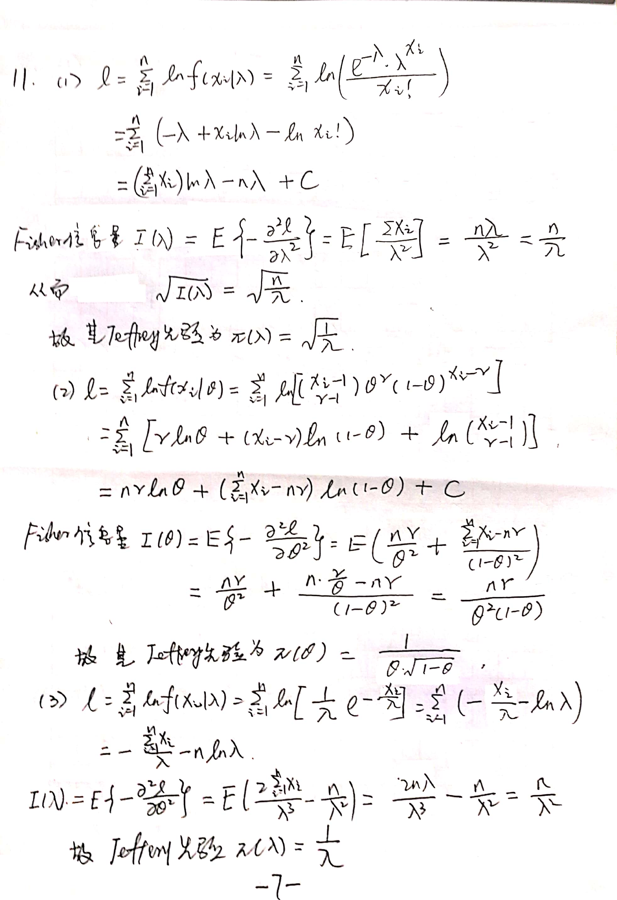

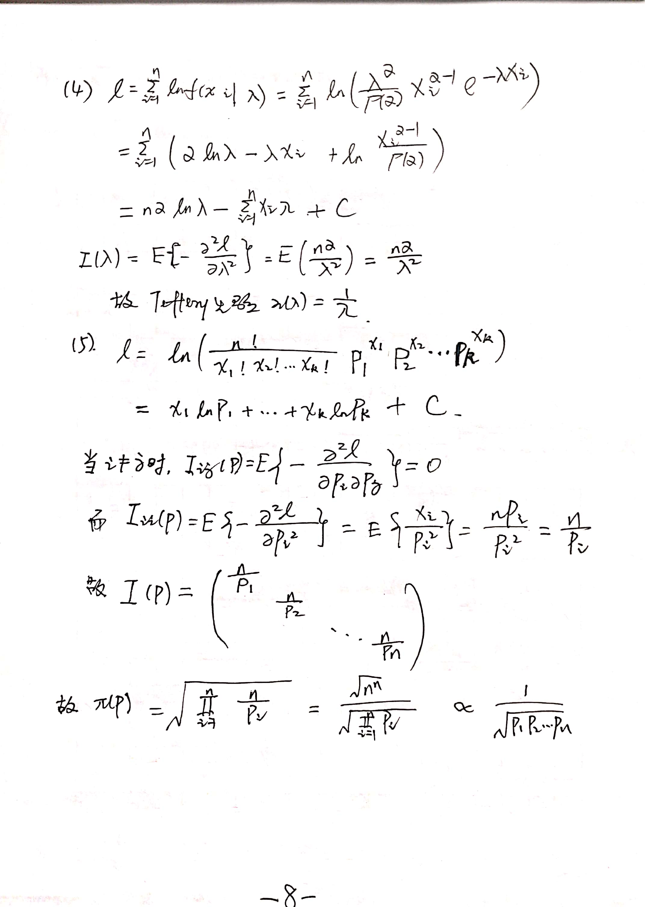

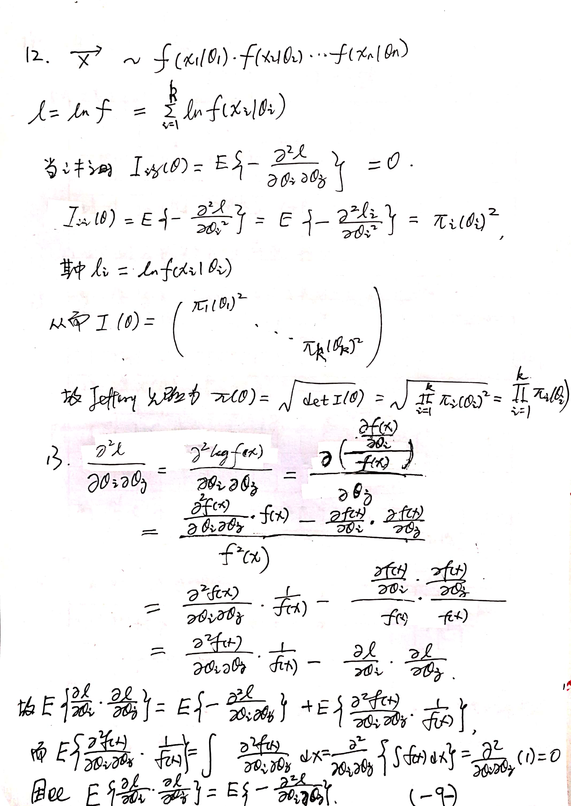

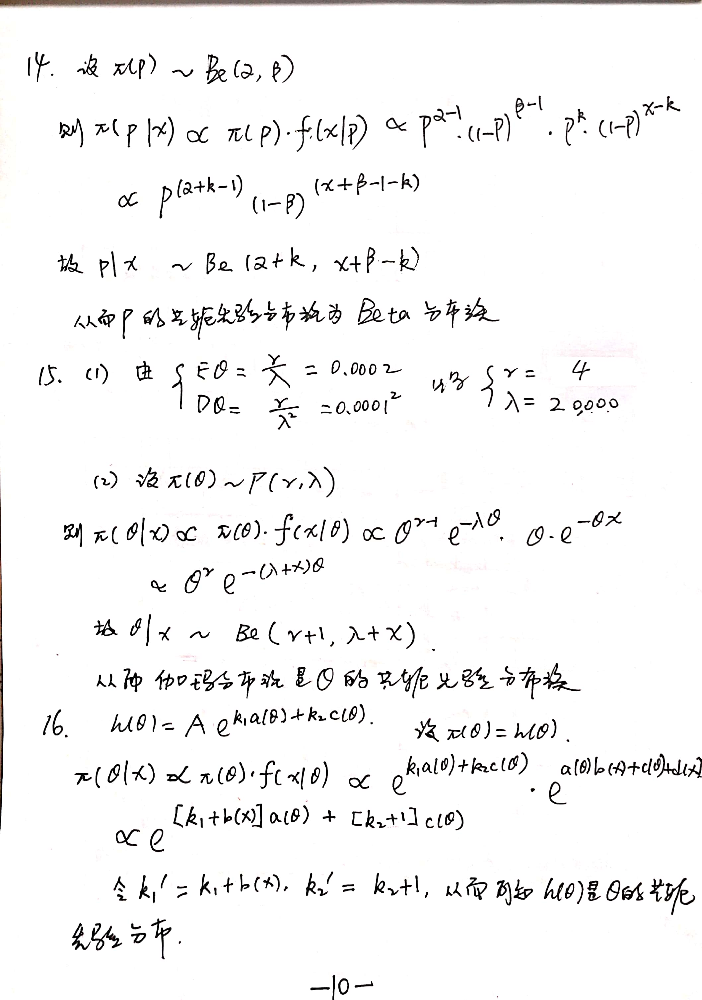

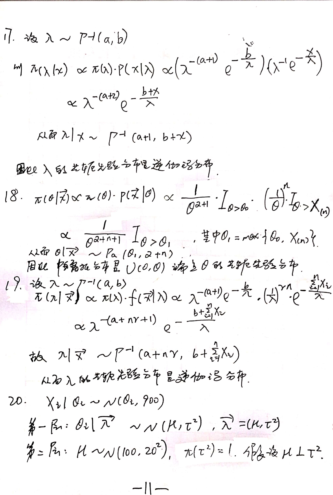

# Click Here To Get Solutions 点击下方获取答案

<https://github.com/liziyue17/Bayesian-Statistics-by-Laisheng-Wei/blob/master/Exercise2/Bayesian%20exercise%202.pdf>

